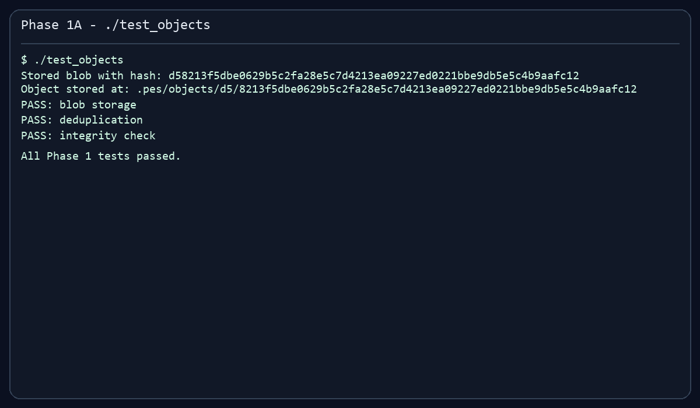
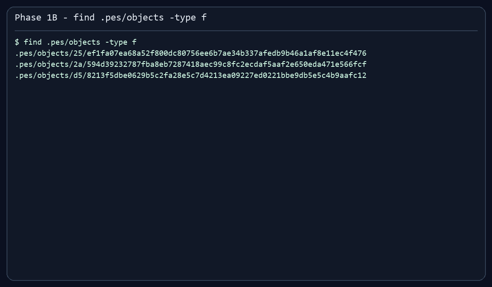
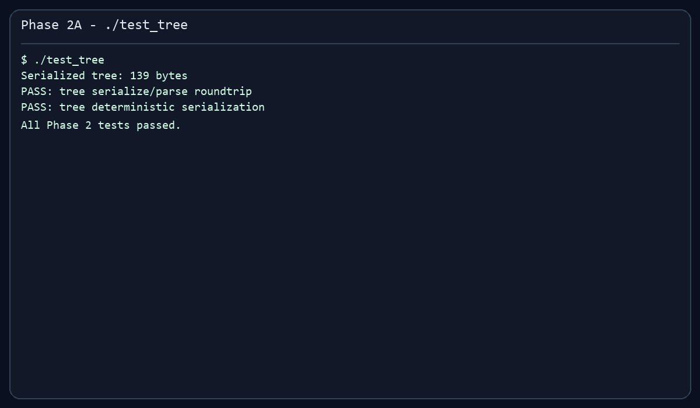
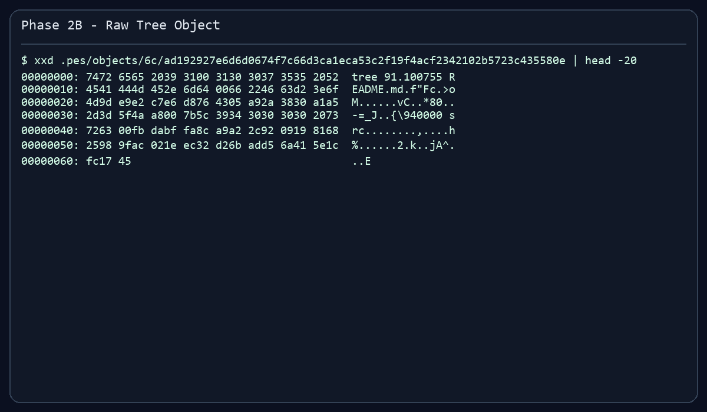
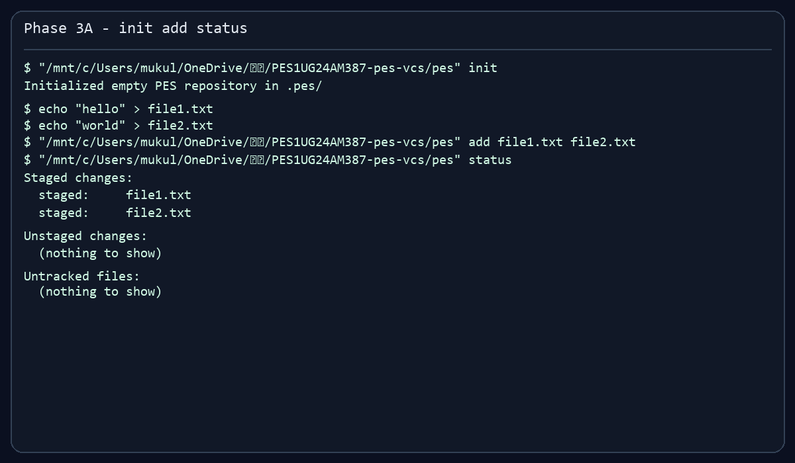
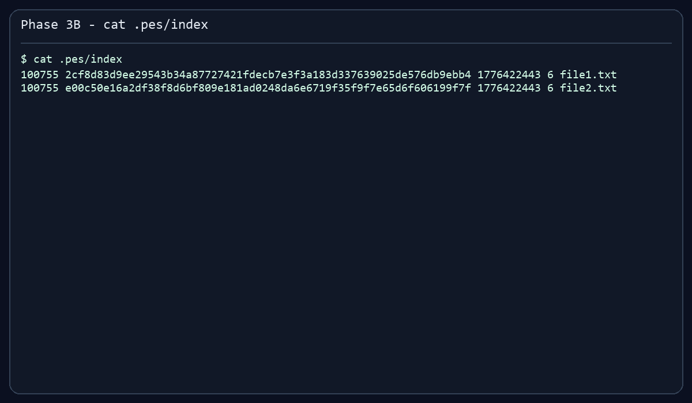
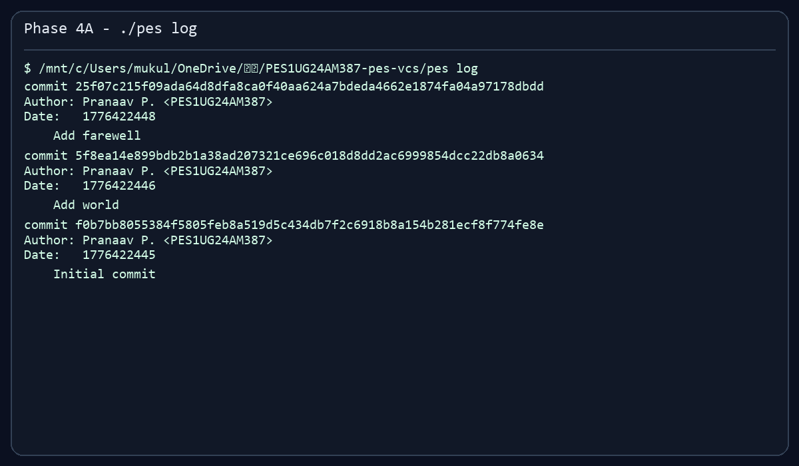
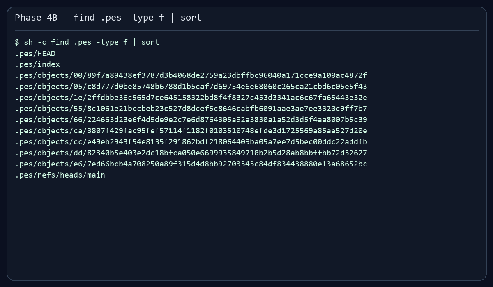
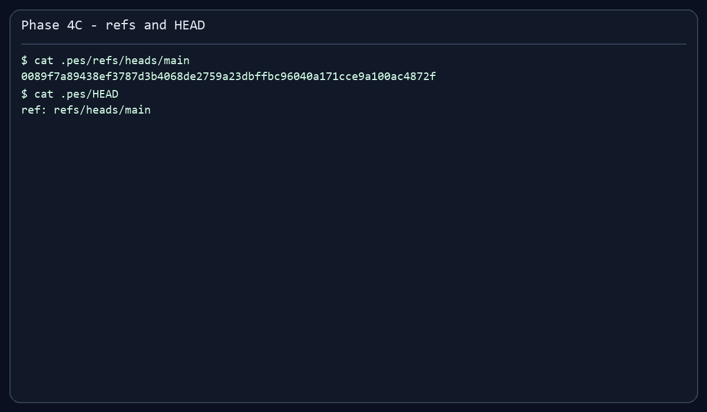
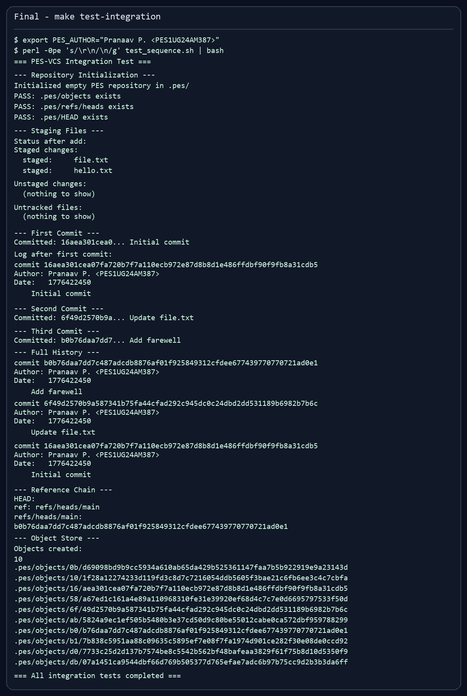

# PES-VCS Lab Report

## Student Details

| Field | Value |
| --- | --- |
| Name | Pranaav P. |
| SRN | PES1UG24AM387 |
| GitHub Username | Pranaav3007 |
| Repository | [Pranaav3007/PES1UG24AM387-pes-vcs](https://github.com/Pranaav3007/PES1UG24AM387-pes-vcs) |

The original lab handout from the template repository has been preserved in [LAB_INSTRUCTIONS.md](LAB_INSTRUCTIONS.md).

## Environment

- Target platform from the assignment: Ubuntu 22.04
- Local implementation and validation: WSL Ubuntu on Windows
- Author string used for PES commits: `Pranaav P. <PES1UG24AM387>`

## Implementation Summary

### Phase 1: Object Storage Foundation

- Implemented `object_write()` in `object.c` to build Git-style object headers, hash the full payload, deduplicate objects, and write through a temp-file-plus-rename flow.
- Implemented `object_read()` to load objects back, recompute the hash for integrity checking, parse the header, and return the payload safely.
- Returned null-terminated payload buffers so commit parsing remains safe without changing any PROVIDED functions.

### Phase 2: Tree Objects

- Implemented `tree_from_index()` in `tree.c` using recursive directory-prefix grouping.
- Added subtree emission so nested paths like `src/main.c` create a directory tree object instead of a flat list.
- Kept tree serialization deterministic by relying on sorted entry emission and handling empty trees safely.

### Phase 3: The Index

- Implemented `index_load()` for the text index format used by `.pes/index`.
- Implemented `index_save()` with path sorting, temp-file writes, and `fsync()` before rename.
- Implemented `index_add()` to hash file contents as blobs, capture file metadata, and update or insert staged entries.
- Moved index sorting to heap memory to avoid stack overflow with large `Index` snapshots.

### Phase 4: Commits and History

- Implemented `commit_create()` in `commit.c`.
- Commits are created from the staged index tree, linked to the current HEAD when present, and written back by updating the current branch ref.
- Validated end-to-end behavior with `pes init`, `pes add`, `pes commit`, `pes log`, and the provided integration sequence.

## Screenshot Evidence

### Phase 1

**1A. `./test_objects`**

Text log: [artifacts/phase1/1A_test_objects.txt](artifacts/phase1/1A_test_objects.txt)

**1B. `find .pes/objects -type f`**

Text log: [artifacts/phase1/1B_objects_find.txt](artifacts/phase1/1B_objects_find.txt)

### Phase 2

**2A. `./test_tree`**

Text log: [artifacts/phase2/2A_test_tree.txt](artifacts/phase2/2A_test_tree.txt)

**2B. Raw tree object via `xxd`**

Text log: [artifacts/phase2/2B_tree_xxd.txt](artifacts/phase2/2B_tree_xxd.txt)

### Phase 3

**3A. `pes init` -> `pes add` -> `pes status`**

Text log: [artifacts/phase3/3A_init_add_status.txt](artifacts/phase3/3A_init_add_status.txt)

**3B. `cat .pes/index`**

Text log: [artifacts/phase3/3B_index_cat.txt](artifacts/phase3/3B_index_cat.txt)

### Phase 4

**4A. `pes log`**

Text log: [artifacts/phase4/4A_pes_log.txt](artifacts/phase4/4A_pes_log.txt)

**4B. `find .pes -type f | sort`**

Text log: [artifacts/phase4/4B_find_pes_files.txt](artifacts/phase4/4B_find_pes_files.txt)

**4C. `cat .pes/refs/heads/main` and `cat .pes/HEAD`**

Text log: [artifacts/phase4/4C_refs_and_head.txt](artifacts/phase4/4C_refs_and_head.txt)

**Final integration run**

Text log: [artifacts/phase4/final_integration_test.txt](artifacts/phase4/final_integration_test.txt)

Note: the repository was edited from Windows, so the provided `test_sequence.sh` checked out with CRLF line endings locally. For the final captured run inside WSL, the script was piped through LF normalization. On a native Ubuntu checkout, `make test-integration` runs directly with the same logic.

## Analysis Questions

### Q5.1: How would `pes checkout <branch>` work?

`pes checkout <branch>` would first read `.pes/refs/heads/<branch>` to get the target commit hash, then update `.pes/HEAD` to point at `ref: refs/heads/<branch>`. After that it would need to read the target commit, walk to its root tree, and rewrite the working directory so tracked files match that tree exactly. The difficult part is not changing the reference file; it is safely transforming the working directory without losing user work. Checkout has to compare the current index, current HEAD tree, target tree, and the actual working files to decide what can be overwritten, what must be deleted, and what should cause the checkout to stop with a conflict.

### Q5.2: How would you detect dirty-working-directory conflicts?

Start from the current index, because it already stores the staged blob hash plus the last known `mtime` and size for each tracked path. For each tracked file, compare the current working file metadata against the index entry. If the metadata differs, the file is dirty relative to the staged snapshot, so compute or look up the blob that belongs to the target branch for the same path. If the target branch wants a different blob than the current branch, and the working file is dirty, checkout must refuse because overwriting that path would lose uncommitted changes. The object store supplies the authoritative hashes for the current and target trees, while the index gives a fast first pass for detecting local edits.

### Q5.3: What happens in detached HEAD state?

In detached HEAD, `.pes/HEAD` contains a commit hash instead of a branch ref. New commits still work, but each new commit advances only the detached HEAD pointer; no branch name moves with it. Those commits can become hard to find later because no branch references them. A user can recover them by creating a new branch ref that points to the detached commit hash, or by copying the hash from logs or reflog-like history and writing it into `.pes/refs/heads/<new-branch>`.

### Q6.1: How would you implement garbage collection?

GC would begin by marking all objects reachable from every live reference: every branch tip in `.pes/refs/heads/`, plus HEAD if it is detached. From each reachable commit, walk parent links and mark the commit object itself, its tree object, every subtree, and every blob reachable from those trees. A hash set is the right data structure for reachability because lookups and inserts are effectively constant time and object IDs are fixed-size keys. After the mark phase, scan `.pes/objects/**` and delete any object whose hash is not in the reachable set. For a repository with 100,000 commits and 50 branches, the exact object count depends on history sharing, but the commit walk would still touch on the order of 100,000 commits plus each distinct tree and blob reachable from them. Because branches usually share most of history, the total number of visited objects is much closer to "all live objects once" than to `100,000 * 50`.

### Q6.2: Why is concurrent GC dangerous?

If GC runs while a commit is being created, it can see a partially published state. For example, the commit path might already have written new blob and tree objects, but the branch ref still points to the old commit because `head_update()` has not happened yet. A concurrent GC that only trusts current refs will consider the new objects unreachable and delete them. Then the commit process updates the branch ref to a commit whose tree or blobs are now missing, corrupting history. Real Git avoids this with careful object reachability rules, lock coordination, grace periods, and by keeping recently created objects protected long enough that concurrent writers can finish publishing their references.

## Deliverables Checklist

- Implemented files: `object.c`, `tree.c`, `index.c`, `commit.c`
- Screenshot directory: [`screenshots/`](screenshots/)
- Raw command transcripts: [`artifacts/`](artifacts/)
- Preserved template handout: [LAB_INSTRUCTIONS.md](LAB_INSTRUCTIONS.md)

## Commit History Note

The repository includes more than the minimum required number of detailed commits, organized with phase-specific commit messages such as `feat(phase2): ...`, `test(phase3): ...`, and `docs(phase4): ...` to make progress easy to audit from `git log --oneline`.
